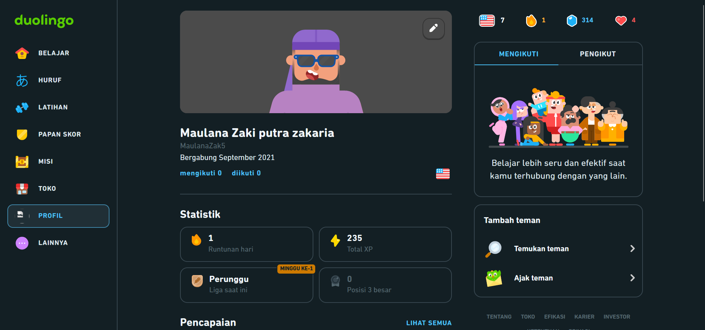
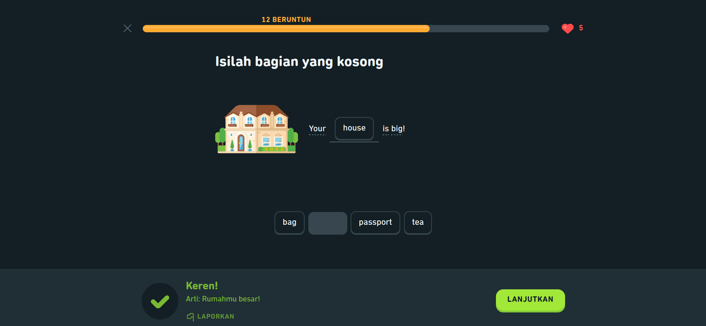
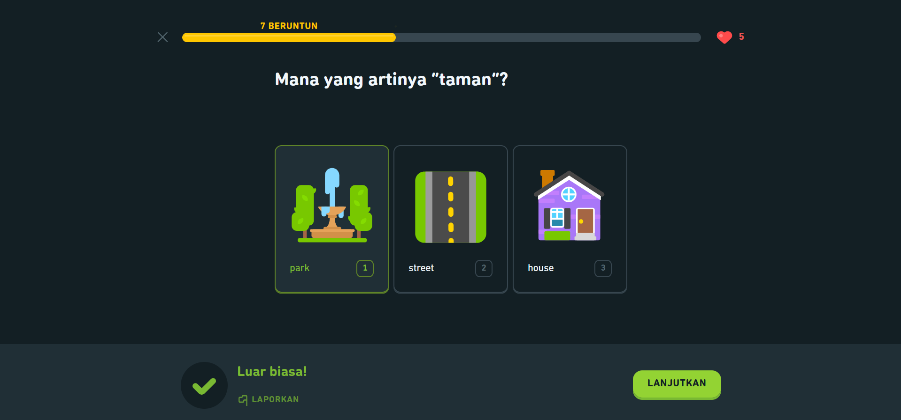
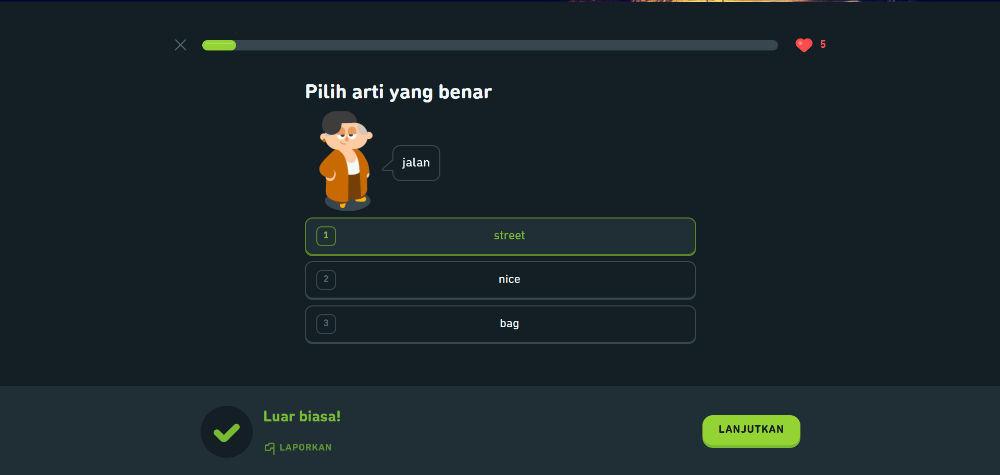
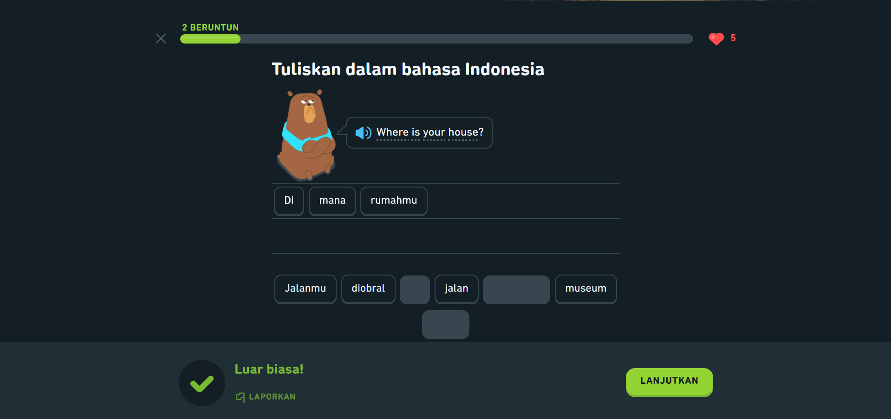
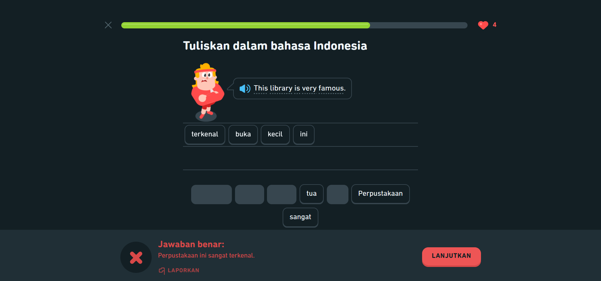
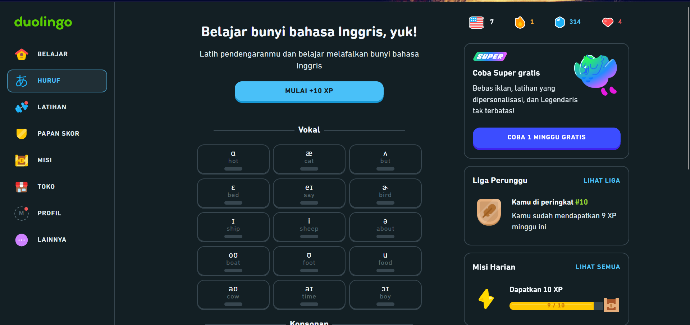
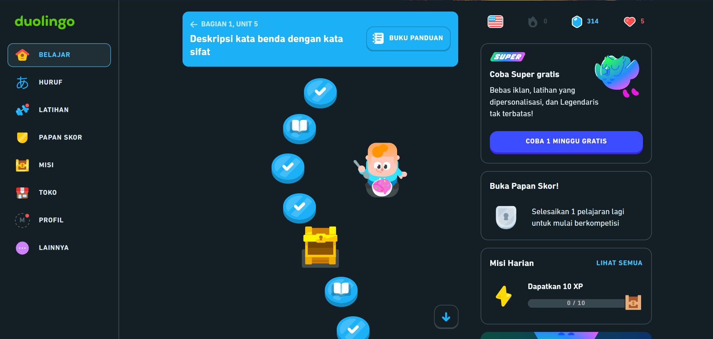
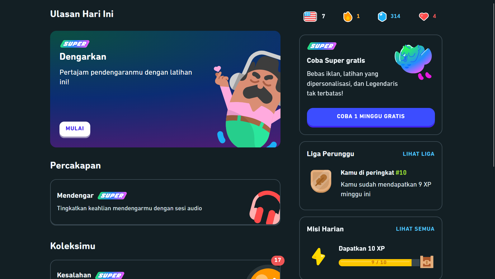
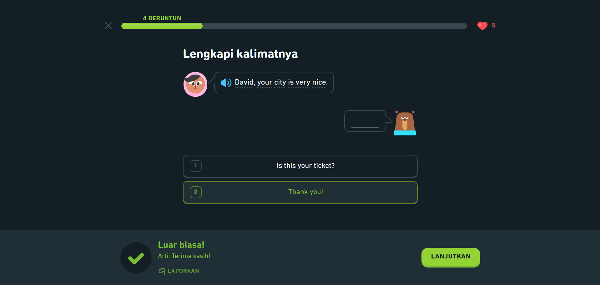

# Analisis UI/UX Duolingo (Web/Desktop)

  
Aku milih Duolingo versi web/desktop sebagai desain interaktif yang mau aku analisis. Fokusnya aku ambil dari beberapa layar latihan (exercise), dashboard, progress, dan profil. Dari situ kelihatan jelas gimana Duolingo “ngarahkan” user supaya tetap belajar, ngerti jawabannya salah/benar, dan termotivasi lanjut.

## Usability Goals (Kebergunaan)

### Efektif (Effectiveness)

Di tiap latihan, Duolingo selalu ngasih instruksi yang tegas dan gampang dipahami. Contohnya di latihan “lengkapi kalimatnya”, user langsung paham harus milih satu jawaban yang pas buat isi dialog.

  
*Keterangan: Instruksi jelas, opsi jawaban disiapkan, dan ada tombol “LANJUTKAN” untuk lanjut.*

Hal yang sama juga kerasa di latihan pilihan arti kata. Pertanyaannya singkat, opsinya jelas, dan ada gambar pendukung biar user nggak cuma mengandalkan teks.

  
*Keterangan: Pertanyaan sederhana + bantuan visual bikin user cepat nangkep maksud soal.*

### Efisien (Efficiency)

Mayoritas latihan bisa selesai cepat karena cukup klik jawaban atau klik token kata. Tombol **LANJUTKAN** posisinya konsisten, jadi user nggak perlu nyari-nyari.

Yang bikin makin efisien, beberapa opsi punya angka (1/2/3), jadi kalau user terbiasa pakai keyboard bisa lebih cepat.

  
*Keterangan: Pilihan jawaban tinggal klik, highlight nunjukin mana yang kepilih.*

Tapi ada juga tipe latihan yang terasa sedikit lebih lama, misalnya susun kata. User tetap bisa menyelesaikannya, cuma butuh waktu lebih untuk membaca semua token.

  
*Keterangan: Word bank membatasi input (aman), tapi bisa agak makan waktu kalau tokennya banyak.*

### Mudah Dipelajari & Mudah Diingat  
(Learnability & Memorability)

Polanya konsisten: judul instruksi di atas, area soal di tengah, feedback di bawah, dan tombol lanjut di kanan bawah. Karena repetitif, user cepat hafal alurnya tanpa perlu adaptasi ulang.

### Aman dari Kesalahan (Safety)

Kalau user salah, Duolingo nggak cuma bilang “salah”, tapi langsung nunjukin jawaban yang benar. Ini bikin user bisa belajar dari kesalahan.

  
*Keterangan: Feedback merah jelas, dan ada “Jawaban benar” untuk recovery.*

Sistem heart/nyawa bikin user lebih hati-hati, walaupun untuk pemula bisa terasa seperti dihukum kalau salah berkali-kali.

### Berguna (Utility)

Dari dashboard, Duolingo nggak cuma ngasih latihan biasa, tapi juga ada latihan khusus seperti latihan bunyi atau vokal.

  
*Keterangan: Ada tombol “MULAI +10 XP” dan latihan vokal buat pendengaran/pelafalan.*

Artinya fitur yang disediakan memang mendukung kebutuhan belajar bahasa, bukan cuma hafalan kata.

## User Experience Goals (Pengalaman Pengguna)

### Memuaskan (Satisfying)

Feedback positif seperti “Luar biasa!” atau “Keren!” bikin user merasa dihargai walaupun cuma menjawab satu soal. Progress bar dan streak juga memberi rasa pencapaian yang kelihatan.

### Memotivasi (Motivating)

Duolingo kuat di sistem motivasi: ada streak, XP, liga, dan misi harian. Di progress path juga ada reward visual seperti peti hadiah yang bikin user terdorong buat lanjut.

  
*Keterangan: Jalur progres + peti reward bikin belajar terasa kayak game.*

Dashboard “Ulasan Hari Ini” membantu user tetap konsisten, walaupun tampilannya cukup ramai karena banyak card informasi sekaligus.

  
*Keterangan: Banyak informasi dalam satu layar, bisa terasa padat untuk user baru.*

### Seru & Engaging

Karakter kartun, warna cerah, dan model latihan seperti mini-game bikin proses belajar terasa ringan dan tidak kaku. Ini penting supaya user nggak cepat bosan.

### Reassuring (Terasa Membimbing)

Setiap kesalahan langsung dikasih jawaban benar, dan ada opsi “Laporkan” kalau ada soal bermasalah. Sistem terasa seperti membimbing, bukan sekadar menguji.

## Design Principles (Prinsip Desain)

### Visibility

Status sistem selalu terlihat: progress bar, streak, heart/nyawa, bahkan reward XP di tombol mulai. User selalu tahu sedang ada di tahap mana.

### Feedback

- Benar → hijau + pujian  
- Salah → merah + jawaban benar  

Respon sistem jelas dan langsung, tidak bikin user bingung.

### Consistency

Layout latihan konsisten, warna benar/salah konsisten, tombol utama selalu **LANJUTKAN**. Karena konsisten, user jarang merasa tersesat.

### Affordance & Signifier

Opsi jawaban dibuat seperti tombol/kartu, dan token kata berbentuk kapsul. Dari tampilannya saja sudah terlihat bahwa elemen itu bisa diklik.

  
*Keterangan: Bentuk visual memberi petunjuk bahwa elemen bisa dipilih.*

### Constraints

Jawaban dibatasi pada opsi yang tersedia. Ini mengurangi kesalahan dan membantu pemula tetap fokus pada konteks soal.

### Error Recovery

Saat salah, sistem langsung memberi jawaban yang benar. Recovery sudah cepat, tetapi akan lebih baik lagi jika ditambahkan penjelasan singkat (misalnya aturan grammar) agar pemahaman lebih dalam.

## Catatan

- Dashboard cukup informatif, tapi agak ramai.
- Sistem heart bisa memotivasi, tapi juga bisa bikin stres untuk pemula.
- Penjelasan tambahan saat salah bisa meningkatkan kualitas pembelajaran.

## Referensi

Contoh analisis design principles (acuan tugas):  
https://manicdx.wordpress.com/2016/01/25/human-computer-interaction-journal-1-good-and-bad-design-principles/
